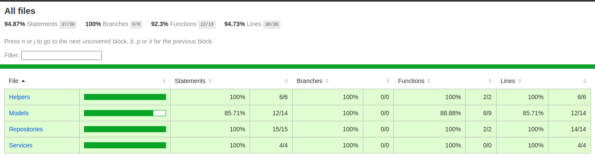

# Prueba de conocimiento - Empresa Pricode.
# Nombre del proyecto Airport-backend
Sistemas puestos de asignación de boletos a los pasajeros aeropuerto local de la ciudad de londres.

https://knotty-calendula-751.notion.site/Prueba-51882ea0a6284372a7f985a2764f961d

Favor tener presente las siguientes recomendaciones:
* Construir el sistema en nestjs, go o node  (Importante)
* Documentar el sistema (no es necesario)
* Implementar testing (un set de pruebas es suficiente)
* Utilizar Docker (si es posible, es un plus)
* Utilizar Firebase (si es posible, es un plus)
* redis (Si es posible, es un plus)
* Colas (Importante)
Determinar el número máximo de vuelos que soporta el sistema (Importante)

#Pasos para probar por parte del desarrollador
* Crear una cuenta de prueba en https://console.firebase.google.com/
* Crear copia del archivo .env.example a .env ingresar los datos que nos entrega firebase
  * FIRESTORE_TYPE=""
  * FIRESTORE_PROJECT_ID=""
  * FIRESTORE_PRIVATE_KEY_ID=""
  * FIRESTORE_PRIVATE_KEY=""
  * FIRESTORE_CLIENT_EMAIL=""
  * FIRESTORE_CLIENT_ID=""
  * FIRESTORE_AUTH_URI=""
  * FIRESTORE_TOKEN_URI=""
  * FIRESTORE_AUTH_CERT_PROVIDER="",
  * FIRESTORE_CLIENT_CERT_URL=""

#Pruebas de cobertura o pruebas unitarias.
